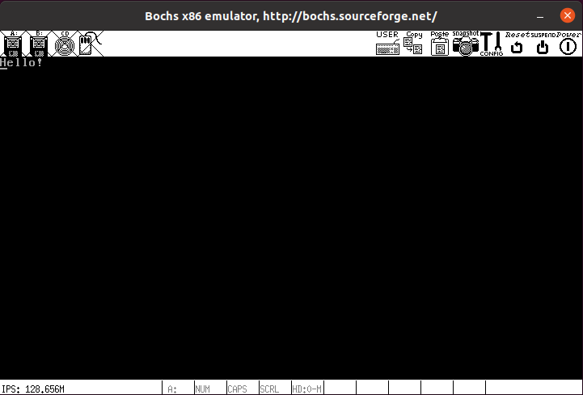

# 00_OS开发环境配置

## 开发环境
* Ubuntu20.4 LTS

## 工具安装
需要使用的工具:
* nasm
* bochs

**`！！！注意事项`**
1. 使用bochs的gui_debug功能需要先安装`libgtk2.0-dev`, 安装方法如下：
```bash
$ sudo apt-get install libgtk2.0-dev
```

2. 编译bochs时指定如下参数：
```bash
 $ ./configure --with-x --with-x11 --enable-debugger --enable-debugger-gui >/dev/null
```

3. 如果执行`bochs -q`命令，gui要等一段时间才出来，可以尝试用root用户执行此命令，gui就会立马出来。


## Hello
第一步写一个简单的功能——在启动界面打印"Hello!"，源码如下：

```assembly
; filename: boot.asm
[org 0x7c00]

mov ax, 3
int 0x10

;初始化段寄存器
mov ax, 0x00
mov ds, ax
mov es, ax
mov ss, ax
mov sp, 0x7c00


; 往显存写Hello
mov ax, 0xb800
mov ds, ax
mov byte[0], 'H'
mov byte[2], 'e'
mov byte[4], 'l'
mov byte[6], 'l'
mov byte[8], 'o'
mov byte[10], '!'

; 阻塞
jmp $

times 510 - ($ - $$) db 0x00
db 0x55, 0xaa
```

### 编译
```bash
$ nasm -f bin boot.asm -o boot.bin
```

### 启动盘设置
```bash
# 创建启动盘
$ bximage -q -hd=16 -func=create -sectsize=512 -imgmode=flat master.img

# 将boot.bin拷贝到启动盘的主引导扇区
$ dd if=boot.bin of=master.img bs=512 count=1 conv=notrunc
```

### bochs配置
执行bochs命令，出现交互提示后按[4]生成配置文件，输入配置文件名（如bochsrc），然后按[7]退出。
打开bochsrc文件，对启动项做修改，将`boot: floppy`改成`boot: disk`，并且配置ata0-master，具体配置如下：
```bash
# configuration file generated by Bochs
display_library: x, options="gui_debug"
memory: host=32, guest=32
romimage: file="/usr/local/share/bochs/BIOS-bochs-latest", address=0x00000000, options=none
vgaromimage: file="/usr/local/share/bochs/VGABIOS-lgpl-latest"
boot: disk
#floppy_bootsig_check: disabled=0
#floppya: type=1_44
# no floppyb
ata0: enabled=true, ioaddr1=0x1f0, ioaddr2=0x3f0, irq=14
ata0-master: type=disk, path="master.img", mode=flat
ata0-slave: type=none
```

最后执行`bochs -q`(如果需要等待较长时间才出现，可以加sudo执行)，效果如下：
